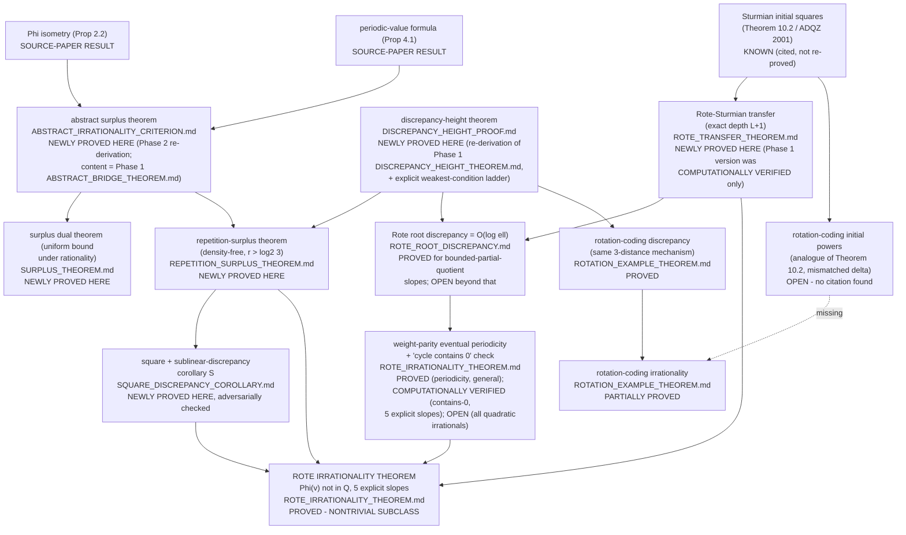

# THEOREM_GRAPH.md

## Bottleneck, made explicit by the graph

Every arrow into **L (the main theorem)** is solid — `PROVED` or `KNOWN` (cited) — **except** the arrow from **K**, which is itself `PROVED` in its general mechanism (eventual periodicity) but only `COMPUTATIONALLY VERIFIED` in its specific decisive content (cycle contains `0`) for five explicit slopes, not proved for all quadratic irrationals. **This is the single precise bottleneck of the entire graph**, isolated exactly as `ROTE_IRRATIONALITY_THEOREM.md`'s "PRECISE MISSING LEMMA" section states it.

The **rotation-coding branch (M–O)** has a genuinely dashed (missing) edge at **N `\to` O**: no citation or proof supplies the rotation-coding analogue of Theorem 10.2 at all — a strictly more open bottleneck than the Rote branch's, consistent with `ROTATION_EXAMPLE_THEOREM.md`'s weaker `PARTIALLY PROVED` classification versus `L`'s `PROVED — NONTRIVIAL SUBCLASS`.

## Legend

- **KNOWN / SOURCE-PAPER RESULT**: cited from the source paper or standard literature, not re-derived here.
- **NEWLY PROVED HERE**: a complete, original proof in this phase (Phase 2).
- **COMPUTATIONALLY VERIFIED**: checked by exact-arithmetic script for specific instances, not proved as a general theorem.
- **OPEN**: identified, precisely stated, not resolved.
